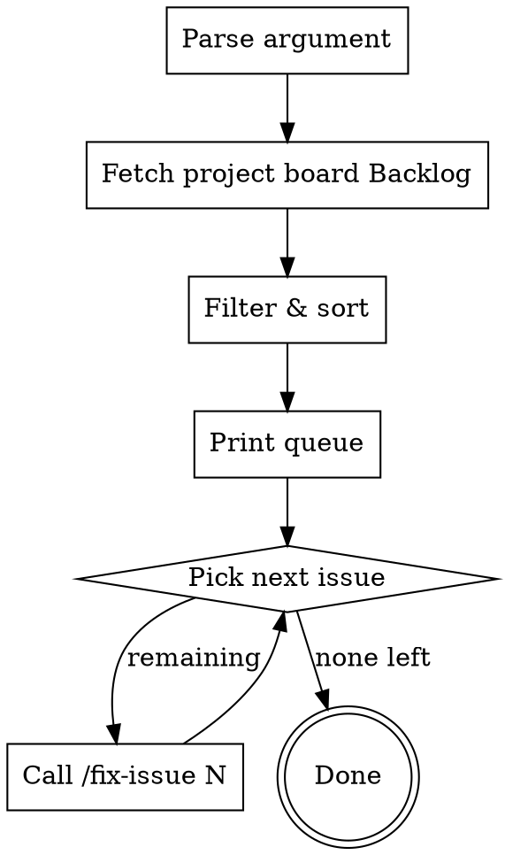

# Fix Issue Batch

Iterate through `[Model]` or `[Rule]` issues **from the Backlog column of the GitHub Project board** and call `/fix-issue` on each one sequentially.

## Invocation

```
/fix-issue-batch <model|rule>
```

## Constants

GitHub Project board IDs (same as fix-issue / project-pipeline):

| Constant | Value |
|----------|-------|
| `PROJECT_NUMBER` | `8` |
| `PROJECT_OWNER` | `CodingThrust` |
| `PROJECT_ID` | `PVT_kwDOBrtarc4BRNVy` |
| `STATUS_FIELD_ID` | `PVTSSF_lADOBrtarc4BRNVyzg_GmQc` |
| `STATUS_READY` | `f37d0d80` |

## Process



---

## Step 1: Parse Argument

Accept one argument: `model` or `rule` (case-insensitive).

- `model` → filter for issues with `[Model]` in the title
- `rule` → filter for issues with `[Rule]` in the title

If no argument or invalid argument → stop with: "Usage: `/fix-issue-batch <model|rule>`"

---

## Step 2: Fetch Issues from Project Board Backlog

Fetch all items from the GitHub Project board and filter to the **Backlog** column:

```bash
gh project item-list 8 --owner CodingThrust --format json --limit 500
```

From the JSON result:
1. Filter items where `status == "Backlog"`
2. Keep only items whose `content.title` starts with `[Model]` or `[Rule]` (matching the argument)
3. For each item, extract: issue number (`content.number`), title (`content.title`), and project item ID (`id`)

Then fetch labels for each matching issue (needed for categorization):

```bash
gh issue view <NUMBER> --repo CodingThrust/problem-reductions --json labels
```

Or batch-fetch with a single search query to avoid N+1:

```bash
gh issue list --repo CodingThrust/problem-reductions \
  --state open --search "[Model] in:title" \
  --json number,title,labels --limit 200
```

Cross-reference the board items with the label data to build the final list.

---

## Step 3: Filter and Sort

From the Backlog issues:

1. **Categorize by current label status:**
   - `already-good` — has `Good` label
   - `has-failures` — has at least one failure label (`PoorWritten`, `Wrong`, `Trivial`, `Useless`)
   - `needs-check` — no check-issue comment yet (no `Good`/`PoorWritten`/`Wrong`/`Trivial`/`Useless` label)
2. **Sort by priority then issue number:** `already-good` first, then `has-failures`, then `needs-check`. Within each group, sort by issue number ascending (oldest first). This prioritizes issues that already have a check report and are closest to being ready.

---

## Step 4: Print Queue

Show the user what will be processed:

```
## Fix queue: [Model] issues (N total)

| # | Issue | Title | Status |
|---|-------|-------|--------|
| 1 | #235 | [Model] SteinerTree | already-good |
| 2 | #233 | [Model] StrongConnectivityAugmentation | has-failures (PoorWritten) |
| 3 | #234 | [Model] FeedbackVertexSet | needs-check |
| ... | ... | ... | ... |

Priority: already-good → has-failures → needs-check.
Processing N issues total.
```

Then ask the user to confirm before starting:

> Ready to start? I'll process each issue with `/fix-issue`, one at a time.
>
> 1. **Start** — begin processing from the first issue
> 2. **Start from #N** — skip to a specific issue number
> 3. **Cancel**

---

## Step 5: Process Each Issue

**CRITICAL:** Each issue MUST be dispatched as a **subagent** for analysis, giving it a fresh context window to prevent cutting corners. The subagent does NOT interact with the human — it returns a structured report, then the main agent presents it for human decisions.

For each issue in the queue (priority order: `already-good` → `has-failures` → `needs-check`):

### 5a: Check prerequisite

If no comment starting with `## Issue Quality Check` exists, run `/check-issue <NUMBER>` first.

### 5b: Dispatch analysis subagent

```
Agent tool:
  subagent_type: "general-purpose"
  description: "Analyze issue #<NUMBER>"
  prompt: |
    Analyze GitHub issue #<NUMBER> for fix-issue.
    1. Fetch the issue: gh issue view <NUMBER> --json title,body,labels,comments
    2. Find the most recent "## Issue Quality Check" comment
    3. Parse all Fail and Warn results (warnings are NOT ignorable)
    4. For each issue, classify as mechanical or substantive
    5. For mechanical issues: apply the fix to a draft body
    6. For substantive issues: prepare 2-3 concrete options with your recommendation

    Return EXACTLY this format:

    ## Analysis for #<NUMBER>: <title>

    ### Auto-fixes applied
    | # | Section | Issue | Fix |
    |---|---------|-------|-----|
    | 1 | ... | ... | ... |

    ### Questions for human
    **Q1: <topic>**
    <description of the problem>
    - (a) <option 1> ← recommended
    - (b) <option 2>
    - (c) <option 3>

    **Q2: ...**

    ### Draft body
    <full updated issue body with mechanical fixes applied, substantive issues marked as `[PENDING Q1]`>
```

### 5c: Present to human

Print the subagent's report and ask the human to answer all questions at once:

```
## Issue #<NUMBER> (<current>/<total>): <title>

<auto-fixes table from subagent>

<questions from subagent>

Please answer the questions above (e.g. "Q1: a, Q2: b"), or type "skip" to skip this issue.
```

### 5d: Apply answers and finalize

After human responds:
- If **"skip"**: move to next issue
- Otherwise: apply the human's choices to the draft body, re-check (run 4 quality checks inline), then finalize on GitHub (edit body, post changelog comment, update labels, move to Ready — see fix-issue Steps 6–8)

### 5e: Continue

Print progress and ask whether to continue:

```
Done #<NUMBER>. (<current>/<total> complete, <remaining> remaining)
Next: #<NEXT_NUMBER> <next_title>
```

> 1. **Continue** — process the next issue
> 2. **Skip next** — skip the next issue and continue to the one after
> 3. **Stop** — end the batch here and print summary

---

## Step 6: Summary

After all issues are processed, print a summary:

```
## Batch fix complete

| Result | Count | Issues |
|--------|-------|--------|
| Fixed & moved to Ready | 7 | #233, #234, #235, #236, #237, #238, #240 |
| Skipped (by user) | 1 | #239 |
| Total | 8 | |
```

---

## Common Mistakes

| Mistake | Fix |
|---------|-----|
| Fetching all open issues instead of board | Only process issues from the **Backlog** column of GitHub Project #8 |
| Skipping already-good issues | Process ALL Backlog issues; `already-good` are processed first (highest priority) |
| Not running check-issue first | If no check report exists, run `/check-issue` before `/fix-issue` |
| Processing in random order | Always sort by issue number ascending within priority groups |
| Continuing after user cancels | Respect cancel/skip requests immediately |
| Missing project scopes | Run `gh auth refresh -s read:project,project` if board access fails |
