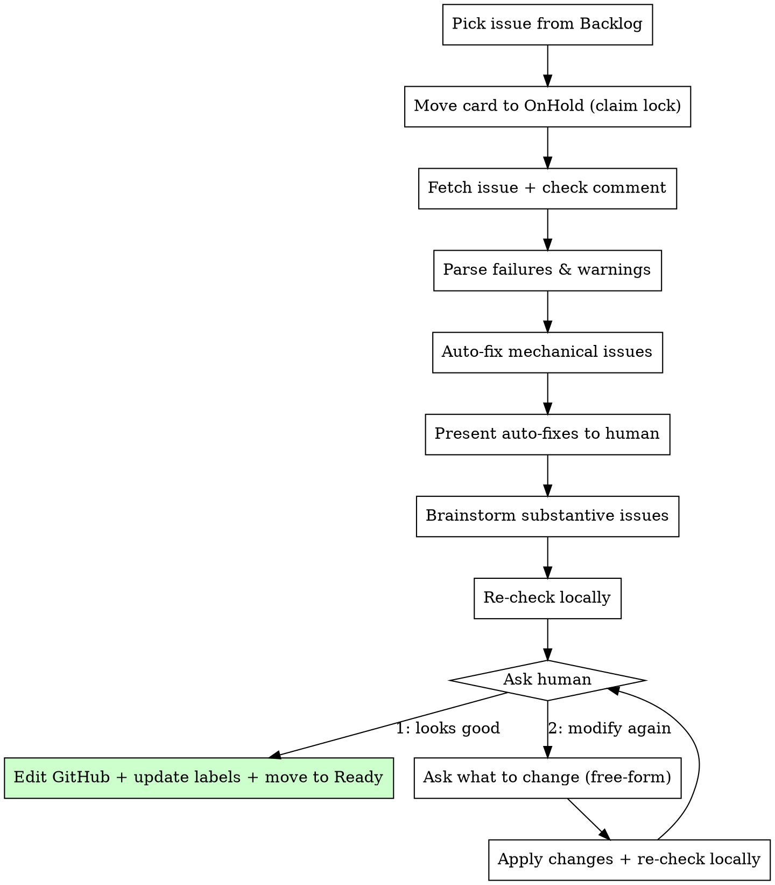

# Fix Issue

Fix errors and warnings from a `check-issue` report. Auto-fixes mechanical issues, brainstorms substantive ones with the human, edits the issue body, re-checks once, then asks the human to approve or iterate.

## Invocation

```
/fix-issue <model|rule|issue-number>
```

- `/fix-issue model` or `/fix-issue rule` — pick next from Backlog
- `/fix-issue 207` — fix a specific issue by number (skip Step 1a/1b, go directly to 1c)

## Constants

GitHub Project board IDs:

| Constant | Value |
|----------|-------|
| `PROJECT_ID` | `PVT_kwDOBrtarc4BRNVy` |
| `STATUS_FIELD_ID` | `PVTSSF_lADOBrtarc4BRNVyzg_GmQc` |
| `STATUS_BACKLOG` | `ab337660` |
| `STATUS_ON_HOLD` | `48dfe446` |
| `STATUS_READY` | `f37d0d80` |

## Process



---

## Step 1: Pick and Claim the Issue

The argument is `model`, `rule`, or a specific issue number.

- If a **number** is given, skip to Step 1c with that issue.
- If `model` or `rule`, pick from the Backlog as below.

### 1a: Fetch candidate list from project board

```bash
uv run --project scripts scripts/pipeline_board.py backlog <model|rule> --format json
```

Returns all Backlog issues of the requested type, sorted by `Good` label first then by issue number:

```json
{
  "issue_type": "rule",
  "items": [
    {"number": 246, "title": "[Rule] A → B", "item_id": "PVTI_xxx", "has_good": true, "labels": ["Good", "rule"]},
    {"number": 91, "title": "[Rule] C to D", "item_id": "PVTI_yyy", "has_good": false, "labels": ["rule"]}
  ]
}
```

### 1b: Pick the top issue

Pick the first item from the list and retain both `<NUMBER>` and `<ITEM_ID>`. If the list is empty, STOP with message: "No `[Model]`/`[Rule]` issues in Backlog."

If the top issue already has the `Good` label and its check report has **0 failures and 0 warnings**, skip to Step 8 (just move it to Ready — no edits needed). If it has warnings, proceed normally.

### 1c: For a specific issue number, locate the board item and validate status

When `/fix-issue <NUMBER>` is used, do **not** start editing immediately. First look up the card:

```bash
uv run --project scripts scripts/pipeline_board.py find <NUMBER>
```

Returns JSON: `{"item_id": "PVTI_xxx", "status": "Backlog", "number": 207, "title": "..."}` or an error if not found.

- If the status is `Backlog`, continue and claim it in Step 1d.
- If the status is `OnHold`, continue only as a **resume** of in-progress `fix-issue` work.
- If the status is anything else (`Ready`, `In progress`, `Review pool`, etc.), STOP with message: "Issue #<NUMBER> is not available for `/fix-issue` because its board status is <STATUS>."
- If an error is returned, STOP with message: "Issue #<NUMBER> is not on the project board."

### 1d: Move the card to OnHold immediately

Claim the work item **before any further action** (before `gh issue view`, before parsing comments, before drafting edits):

```bash
uv run --project scripts scripts/pipeline_board.py move <ITEM_ID> OnHold
```

This is a temporary lock to avoid two agents or humans editing the same issue concurrently. Do not leave the card in Backlog while you inspect or modify it.

Use `OnHold` as the in-progress state for `/fix-issue`. Once claimed, do not move the issue back to `Backlog` automatically; keep it in `OnHold` until Step 8 or explicit human re-triage.

If the issue is already in `OnHold` because you are resuming previously started `fix-issue` work, do not move it again; just continue.

### 1e: Fetch the chosen issue and related context

```bash
gh issue view <NUMBER> --json title,body,labels,comments
```

- Find the **most recent** comment that starts with `## Issue Quality Check` — this is the check-issue report
- If no check comment found, run `/check-issue <NUMBER>` first, then re-fetch the issue

**Cross-reference lookup (required):**

- **For `[Model]` issues:** Fetch **all** associated `[Rule]` issues that reference this problem as source or target. Search broadly — the problem name may appear in different forms (CamelCase, spaces, abbreviations):
  ```bash
  gh issue list --search "<ProblemName> in:title label:rule" --state open --json number,title,body --limit 50
  ```
  Read the body of each matching rule issue to understand how the model is used (what fields the rule constructs, whether it relies on decision vs optimization framing, what overhead expressions reference). This context is essential for making informed decisions about schema, framing, and naming.

- **For `[Rule]` issues:** Check whether the source and target models exist in the codebase or as issues:
  ```bash
  # Check if models exist in pred
  pred show <SourceModel> 2>&1
  pred show <TargetModel> 2>&1
  # Check for model issues if not in pred
  gh issue list --search "<SourceModel> in:title label:model" --state open --json number,title,body --limit 10
  gh issue list --search "<TargetModel> in:title label:model" --state open --json number,title,body --limit 10
  ```
  Read relevant model issue bodies to understand schema fields, variants, and framing. This informs whether the rule's overhead expressions, field names, and algorithm are consistent with the models.

---

## Step 2: Parse Failures and Warnings

Extract from the check comment's summary table:

| Field | How to extract |
|-------|---------------|
| Check name | First column (Usefulness, Non-trivial, Correctness, Well-written) |
| Result | Second column (Pass / Fail / Warn) |
| Details | Third column (one-line summary) |

Then parse the detailed sections below the table for specifics:
- Each `### <Check Name>` section contains the full explanation
- The `#### Recommendations` section (if present) contains suggestions

Build a structured list of **all issues to fix** — include both `Fail` **and** `Warn` results. Warnings are not ignorable; they must be resolved before moving to Ready.

Tag each issue as:
- `mechanical` — can be auto-fixed without human input
- `substantive` — requires human brainstorming

### Classification Rules

**Mechanical** (auto-fixable):

| Issue pattern | Fix strategy |
|--------------|-------------|
| Undefined symbol in overhead/algorithm | Add definition derived from context (e.g., "let n = \|V\|") |
| Inconsistent notation across sections | Standardize to the most common usage in the issue |
| Missing/wrong code metric names | Look up correct names via `pred show <target> --json` → `size_fields`. If `size_fields` is empty, use the plain-text `pred show <target>` output which lists Fields directly |
| Formatting issues (broken tables, missing headers) | Reformat to match issue template |
| Incomplete `(TBD)` in fields derivable from other sections | Fill from context |
| Incorrect DOI format | Reformat to `https://doi.org/...` |

**Substantive** (brainstorm with human, ask for human's input):

| Issue pattern | Why human input needed |
|--------------|----------------------|
| Naming decisions (optimization prefix, CamelCase choice, too long name) | Codebase convention judgment call |
| Missing or incorrect complexity bounds | Requires literature verification |
| Missing type dependencies | Architectural decision about codebase |
| Incorrect mathematical claims | Domain expertise needed |
| Incomplete reduction algorithm | Core technical content |
| Incomplete or trivial example | Present **3 concrete example options** with pros/cons (use `AskUserQuestion` with previews showing vertex/edge counts, optimal values, and suboptimal cases). Prefer examples that match the model issue's example when a companion model exists. |
| Decision vs optimization framing | **Default to objective-style models** unless evidence points otherwise. In the current aggregate-value architecture, that usually means `type Value = Max<_>`, `Min<_>`, or `Extremum<_>` when the sense is runtime data. Check associated `[Rule]` issues (`gh issue list --search "<ProblemName> in:title label:rule"`) to see how rules use this model — if rules only need the decision version (e.g., reducing to SAT with a bound), an objective model still works because the bound can be read from the optimal aggregate value. Use `Or` for inherently existential feasibility problems (SAT, KColoring) where there is no natural objective. Use aggregate-only values such as `Sum<_>` or `And` only when the answer is genuinely a fold over all configurations and there is no representative witness. If switching to an objective model, add the appropriate `Minimum`/`Maximum` prefix per codebase conventions. |
| Ambiguous overhead expressions | Requires understanding the reduction |

---

## Step 3: Auto-Fix Mechanical Issues

For each `mechanical` issue:

1. Identify the exact section in the issue body that needs editing
2. Apply the fix
3. Record what was changed (for presenting to human in Step 4)

Use `cargo run -p problemreductions-cli --bin pred -- show <problem>` (or `./target/debug/pred show <problem>` after `make cli`) to look up:
- Valid problem names and aliases
- `size_fields` for correct metric names (via `--json`); if empty, use plain-text output which lists Fields directly
- Existing variants and fields

**Do NOT edit the issue on GitHub yet** — collect all fixes (mechanical + substantive) first.

---

## Step 4: Present Full Context and Auto-Fixes to Human

**IMPORTANT: Show all context BEFORE asking for any decisions.**

Present everything in one block so the human has full visibility:

1. **Full problem definition** — quote the issue's Definition and Schema sections verbatim so the human can see exactly what is being discussed without switching to the browser. For rule issues, include the Reduction Algorithm and Size Overhead sections instead.
2. **Check report summary** — the parsed table from Step 2 (Check / Result / Details). For `Fail` or `Warn` results, include the specific sub-issues from the detailed section, not just the one-liner.
3. **Related issues** — for model issues, list all associated rule issues found in Step 1e with a one-line summary of how each rule uses this model (fields referenced, framing assumed). For rule issues, state whether the source and target models exist in `pred` or as open issues, and note any schema/framing mismatches.
4. **Research results** — any web searches, `pred show` lookups, or other research gathered during Steps 2–3.
5. **Auto-fixes applied** — table of mechanical fixes (Section / Issue / Fix).
6. **Substantive issues requiring input** — numbered list of issues that need human judgment, with enough context for the human to evaluate each one.

---

## Step 5: Brainstorm Substantive Issues

For each substantive issue, present it to the human **one at a time**:

1. **Show the evidence first** — quote the relevant check report section, web research results, `pred show` output, or related rule/model issue findings that inform this decision. The human should be able to evaluate the options based on the evidence shown, not just the option labels. If the issue's Definition or Schema is relevant to the decision, quote the relevant sections inline.
2. State the problem clearly
3. Offer 2-3 concrete options when possible (with your recommendation)
4. Wait for the human's response
5. Apply the chosen fix to the draft issue body

**Example instances require special handling:** If the example is flagged as incorrect, incomplete, or trivial, you MUST present **3 concrete example options** using `AskUserQuestion` with previews. Each preview should show the full graph/instance specification, optimal value, suboptimal cases, and an invalid configuration. Do NOT silently reuse or fix the existing example without offering alternatives — the human must choose.

Use web search if needed to help resolve issues:
- Literature search for correct complexity bounds
- Verify algorithm claims
- Find better references

After all substantive issues are resolved, show the human the complete updated issue body (or a diff summary if the body is long).

---

## Step 6: Re-Check Locally

Re-run the 4 quality checks (Usefulness, Non-trivial, Correctness, Well-written) from `check-issue` against the **draft issue body** (not yet pushed to GitHub). Use `pred show`, `pred path`, web search as needed. Do NOT post a GitHub comment.

Print results to the human as a summary table (Check / Result / Details).

If the issue cannot be completed in this session because the check report is missing, the issue body is malformed, required context is unavailable, or the proposed fix turns out to be wrong, STOP and tell the human exactly what blocked completion. Leave the card in `OnHold`.

---

## Step 7: Ask Human for Decision

Show the human the draft issue body.

Use `AskUserQuestion` to present the options:

> The issue has been re-checked locally. What would you like to do?
>
> 1. **Looks good** — I'll push the edits to GitHub, update labels, and move it from OnHold to Ready
> 2. **Modify again** — tell me what else you'd like to change

### If human picks 2: Modify Again

Ask the human (free-form) what they want to change:

> What would you like to modify? Describe the changes you want.

Apply the requested changes to the draft issue body, re-check locally (Step 6), then ask again (Step 7). Repeat until the human picks "Looks good".

If the session pauses without approval, leave the card in `OnHold`. Do **not** move it back to Backlog automatically; `OnHold` is the conflict-avoidance state for partially completed `fix-issue` work.

---

## Step 8: Finalize (If human picks 1 "Looks good")

Only reached when the human approves. Now push everything to GitHub.

### 8a: Edit the issue body and title

Use the Write tool to save the updated body to `/tmp/fix_issue_body.md`, then:

```bash
gh issue edit <NUMBER> --body-file /tmp/fix_issue_body.md
```

If the problem name was changed (e.g., renamed to add `Minimum`/`Maximum` prefix), also update the issue **title**:

```bash
gh issue edit <NUMBER> --title "[Model] NewProblemName"
```

Then find and update **all related issues** that reference the old name in their title:

```bash
gh issue list --search "OldName in:title" --state open --json number,title
# For each related issue, update the title:
gh issue edit <RELATED_NUMBER> --title "<updated title>"
```

### 8b: Comment on the issue with a changelog

Post a comment summarizing what was changed, so reviewers can see the diff at a glance:

```bash
gh issue comment <NUMBER> --body "$(cat <<'EOF'
## Fix-issue changelog

- <bullet for each change made, e.g. "Fixed undefined symbol `m` in Size Overhead section">
- ...

Applied by `/fix-issue`.
EOF
)"
```

### 8c: Update labels

```bash
gh issue edit <NUMBER> --remove-label "Useless,Trivial,Wrong,PoorWritten" 2>/dev/null
gh issue edit <NUMBER> --add-label "Good"
```

### 8d: Move from OnHold to Ready on project board

Use the `item_id` obtained from Step 1b/1c:

```bash
uv run --project scripts scripts/pipeline_board.py move <ITEM_ID> Ready
```

### 8e: Confirm

```text
Done! Issue #<NUMBER>:
  - Body updated on GitHub
  - Labels: removed failure labels, added "Good"
  - Board: moved OnHold -> Ready
```

---

## Common Mistakes

| Mistake | Fix |
|---------|-----|
| Pushing to GitHub before human approves | All edits stay local until human picks "Looks good" |
| Hallucinating paper content for complexity bounds | Use web search; if not found, say so and ask human |
| Using `pred show` on a problem that doesn't exist yet | Check existence first; for new problems, skip metric lookup |
| Overwriting human's original content | Preserve original text; only modify the specific sections flagged |
| Not preserving `<!-- Unverified -->` markers | Keep existing provenance markers; add new ones for AI-filled content |
| Running check-issue more than once per iteration | Re-check exactly once after edits, then ask human |
| Leaving the card in Backlog while you inspect/edit | Move it to OnHold before `gh issue view` or any drafting, and keep blocked work there |
| Closing the issue | Never close. Labels and board status only |
| Force-pushing or modifying git | This skill only edits GitHub issues via `gh`. No git operations |
| Inventing `pipeline_board.py` subcommands | Only `next`, `claim-next`, `ack`, `list`, `move`, `backlog`, `find` exist |
| Forgetting to update the issue title | If the problem name changed, update the title with `gh issue edit <N> --title "..."` and find all related issues referencing the old name |
| Asking questions without context | Before every `AskUserQuestion`, show the relevant issue content (definition, example, constraints) so the human can make an informed decision |
| Not showing the full problem definition in Step 4 | Always quote the Definition and Schema (or Reduction Algorithm and Size Overhead for rules) verbatim in Step 4 so the human has the full picture without switching to the browser |
| Skipping cross-reference lookup for models | For model issues, fetch and read **all** associated rule issues to understand how the model is used before making framing/schema decisions |
| Skipping cross-reference lookup for rules | For rule issues, check whether source and target models exist in `pred` or as open issues, and read their schema/framing to ensure consistency |
