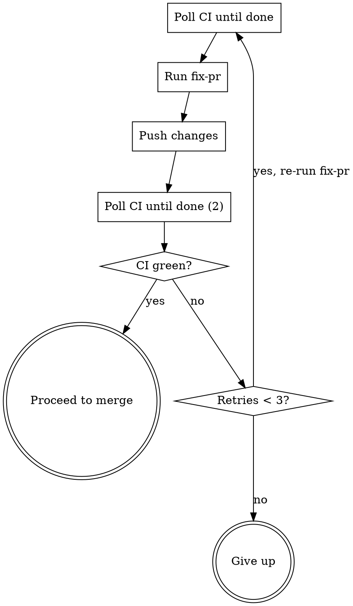

# Meta-Power

Batch-process open `[Model]` and `[Rule]` issues end-to-end: plan, implement, review, fix CI, and merge — fully autonomous.

## Overview

You are the **outer orchestrator**. For each issue you invoke existing skills and shell out to subprocesses. You never implement code directly — `make run-plan` does the heavy lifting in a separate Claude session.

**Batch context:** When invoking sub-skills (like `issue-to-pr`), you are running in batch mode. Auto-approve any confirmation prompts from sub-skills — do not wait for user input mid-batch.

## Step 0: Discover and Order Issues

```bash
# Fetch all open issues
gh issue list --state open --limit 50 --json number,title
```

Filter to issues whose title contains `[Model]` or `[Rule]`. Partition into two buckets, sort each by issue number ascending. Final order: **all Models first, then all Rules**.

**Check for existing PRs:** For each issue, check if a PR already exists:
```bash
gh pr list --search "Fixes #<number>" --state open --json number,headRefName
```
If a PR exists, mark the issue as `resume` — skip Step 1 (plan) and jump to Step 2 (execute) or Step 4 (fix loop) depending on whether the PR already has implementation commits.

Present the ordered list to the user for confirmation before starting:

```
Batch plan:
  Models:
    #108  [Model] LongestCommonSubsequence
    #103  [Model] SubsetSum          (has open PR #115 — will resume)
  Rules:
    #109  [Rule] LCS → MIS
    #110  [Rule] LCS → ILP
    #97   [Rule] BinPacking → ILP
    #91   [Rule] CVP → QUBO

Proceed? (user confirms)
```

Initialize a results table to track status for each issue.

## Step 1: Plan (issue-to-pr)

For the current issue:

```bash
git checkout main && git pull origin main
```

**Check for stale branches:** If a branch `issue-<number>-*` exists with no open PR, delete it to start fresh:
```bash
STALE=$(git branch --list "issue-<number>-*" | head -1 | xargs)
if [ -n "$STALE" ]; then
    git branch -D "$STALE"
    git push origin --delete "$STALE" 2>/dev/null || true
fi
```

Invoke the `issue-to-pr` skill with the issue number. This creates a branch, writes a plan to `docs/plans/`, and opens a PR.

**If `issue-to-pr` fails** (e.g., incomplete issue template): record status as `skipped (plan failed)`, move to next issue.

Capture the PR number for later steps:
```bash
PR=$(gh pr view --json number --jq .number)
```

## Step 2: Execute (make run-plan)

Run the plan in a separate Claude subprocess:

```bash
make run-plan
```

This spawns a new Claude session (up to 500 turns) that reads the plan and implements it using `add-model` or `add-rule`.

**If the subprocess exits non-zero:** record status as `skipped (execution failed)`, move to next issue.

## Step 3: Review

After execution completes, push and request Copilot review:

```bash
git push
make copilot-review
```

## Step 4: Fix Loop (max 3 retries)



For each retry:

1. **Wait for CI to complete** (poll every 30s, up to 15 minutes):
   ```bash
   REPO=$(gh repo view --json nameWithOwner --jq .nameWithOwner)
   for i in $(seq 1 30); do
       sleep 30
       HEAD_SHA=$(gh api repos/$REPO/pulls/$PR | python3 -c "import sys,json; print(json.load(sys.stdin)['head']['sha'])")
       STATUS=$(gh api repos/$REPO/commits/$HEAD_SHA/check-runs | python3 -c "
   import sys,json
   runs = json.load(sys.stdin)['check_runs']
   failed = [r['name'] for r in runs if r.get('conclusion') not in ('success', 'skipped', None)]
   pending = [r['name'] for r in runs if r.get('conclusion') is None and r['status'] != 'completed']
   if pending:
       print('PENDING')
   elif failed:
       print('FAILED')
   else:
       print('GREEN')
   ")
       if [ "$STATUS" != "PENDING" ]; then break; fi
   done
   ```

   - If `GREEN` on the **first** iteration (before any fix-pr): skip the fix loop entirely, proceed to merge.
   - If `GREEN` after a fix-pr pass: break out of loop, proceed to merge.
   - If `FAILED`: continue to step 2.
   - If still `PENDING` after 15 min: treat as `FAILED`.

2. **Invoke `/fix-pr`** to address review comments, CI failures, and coverage gaps.

3. **Push fixes:**
   ```bash
   git push
   ```

4. Increment retry counter. If `< 3`, go back to step 1 (poll CI). If `= 3`, give up.

**After 3 failed retries:** record status as `fix-pr failed (3 retries)`, leave PR open, move to next issue.

## Step 5: Merge

```bash
gh pr merge $PR --squash --delete-branch --auto
```

The `--auto` flag tells GitHub to merge once all required checks pass, avoiding a race between CI completion and the merge command.

**If merge fails** (e.g., conflict): record status as `merge failed`, leave PR open, move to next issue.

Wait for the auto-merge to complete before proceeding:
```bash
for i in $(seq 1 20); do
    sleep 15
    STATE=$(gh pr view $PR --json state --jq .state)
    if [ "$STATE" = "MERGED" ]; then break; fi
    if [ "$STATE" = "CLOSED" ]; then break; fi  # merge conflict closed it
done
```

## Step 6: Sync

Return to main for the next issue:

```bash
git checkout main && git pull origin main
```

This ensures the next issue (especially a Rule that depends on a just-merged Model) sees all prior work.

## Step 7: Report

After all issues are processed, print the summary table:

```
=== Meta-Power Batch Report ===

| Issue | Title                              | Status                    |
|-------|------------------------------------|---------------------------|
| #108  | [Model] LCS                        | merged                    |
| #103  | [Model] SubsetSum                  | merged (resumed PR #115)  |
| #109  | [Rule] LCS → MIS                  | merged                    |
| #110  | [Rule] LCS → ILP                  | fix-pr failed (3 retries) |
| #97   | [Rule] BinPacking → ILP           | merged                    |
| #91   | [Rule] CVP → QUBO                 | skipped (plan failed)     |

Completed: 4/6 | Skipped: 1 | Failed: 1
```

## Constants

| Name | Value | Rationale |
|------|-------|-----------|
| `MAX_RETRIES` | 3 | Most issues fix in 1-2 rounds |
| `CI_POLL_INTERVAL` | 30s | Frequent enough to react quickly |
| `CI_POLL_MAX` | 15 min | Upper bound for CI completion |
| `MERGE_POLL_INTERVAL` | 15s | Wait for auto-merge to land |
| `MERGE_POLL_MAX` | 5 min | Upper bound for merge completion |

## Common Failure Modes

| Symptom | Cause | Mitigation |
|---------|-------|------------|
| `issue-to-pr` comments and stops | Issue template incomplete | Skip; user must fix the issue |
| `make run-plan` exits non-zero | Implementation too complex for 500 turns | Skip; needs manual work |
| CI red after 3 retries | Deep bug or flaky test | Leave PR open for human review |
| Merge conflict | Concurrent push to main | Leave PR open; manual rebase needed |
| Rule fails because model missing | Model issue was skipped earlier | Expected; skip rule too |
| Stale branch from previous run | Previous meta-power run failed mid-issue | Auto-cleaned in Step 1 |
| PR already exists for issue | Previous partial attempt | Resumed from existing PR |
