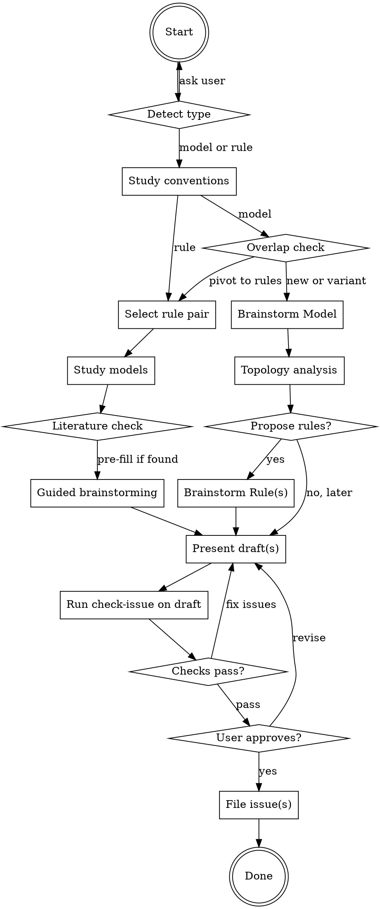

# Propose a New Model or Rule

Interactive brainstorming skill that helps domain experts (who may not know the codebase) design a new problem model or reduction rule, then files well-formed GitHub issues.

**No programming knowledge required.** This skill works entirely in mathematical / domain language.

## Invocation

```
/propose
/propose model
/propose rule
```

<HARD-GATE>
Do NOT write any code, create any files, or invoke implementation skills (add-model, add-rule, issue-to-pr).
The ONLY output of this skill is GitHub issues filed via `gh issue create`.
</HARD-GATE>

## Process



---

## Step 1: Detect Type

If the user didn't specify, use `AskUserQuestion`:

```
AskUserQuestion:
  question: "What would you like to propose?"
  header: "Type"
  options:
    - label: "New problem (model)"
      description: "Define a new computational problem to add to the reduction graph"
    - label: "New reduction rule"
      description: "Add a reduction between two existing problems"
```

---

## Step 1b: Study Conventions

Right after the user picks model or rule, **study at least one existing case** in the relevant category before asking any brainstorming questions. This grounds the conversation in the project's actual conventions and helps produce higher-quality drafts.

### For Models

1. Ask the user a brief orienting question (free text):
   > "What problem are you thinking of? A name or rough description is enough."

2. Based on the answer, identify the most similar existing problem in the graph. Use `pred list --json` to find candidates, then use `pred show <similar_problem>` to study one in detail:

   ```bash
   pred show <similar_problem> --json
   ```

   Also find and read one closed `[Model]` issue in the same category:

   ```bash
   gh issue list --label model --state closed --limit 20 --json number,title,body | jq '[.[] | select(.title | test("<keyword>"; "i"))] | .[0]'
   ```

   If no keyword match, just read the most recent closed model issue to see the template conventions.

3. **Note internally** (do not dump raw output to the user):
   - What fields / size fields the similar problem has
   - How the issue defines variables, schema, complexity
   - What level of mathematical detail is expected in examples
   - How the "Reduction Rule Crossref" section is structured

   Use these conventions to guide the brainstorming questions and draft formatting in later steps.

4. **Check for overlap with existing problems.** If the most similar problem is the *same problem* the user described (or a close generalization/restriction), surface this immediately via `AskUserQuestion` before continuing brainstorming:

   ```
   AskUserQuestion:
     question: "I found that <ExistingProblem> already exists [status]. Your idea looks like a [variant/restriction/generalization]. How should we proceed?"
     header: "Overlap"
     options:
       - label: "Propose a specialized variant"
         description: "Define a new problem type for the restricted case (e.g., tournament restriction of a general digraph problem)"
       - label: "Propose rules for the existing problem"
         description: "Connect the existing problem to the graph — switches to the rule proposal flow"
       - label: "Both — variant + rules"
         description: "Propose the specialized variant AND rules connecting both versions"
   ```

   - If the user picks **"Propose rules"**, pivot to the **For Rules** flow (Step 3 for Rules). This is the only supported mid-flow type pivot.
   - If the user picks **"Both"**, continue the model flow and flag that companion rules should also connect the existing problem.
   - **Show the existing problem's schema** so the user can design for compatibility:
     > "Here's how <ExistingProblem> is defined: [field summary from `pred show`]. Your variant can mirror this structure where applicable."
   - If the existing problem is an orphan, mention this — it increases the value of connecting both problems.

### For Rules

1. **Run topology analysis first** to identify the most impactful missing reductions, then present the top candidates as recommendations. Only ask the user an open-ended "which two problems?" question if they don't have a specific pair in mind — otherwise, use the topology data to populate `AskUserQuestion` options in Step 3.1 directly.

   Run these commands silently before asking any questions:
   ```bash
   # Core data (fast — uses pre-built pred binary)
   pred list --json
   gh issue list --label rule --state open --limit 500 --json number,title

   # Topology analysis (slower — compiles example binaries, but gives orphan/NP-hardness data)
   cargo run --example detect_isolated_problems 2>/dev/null
   cargo run --example detect_unreachable_from_3sat 2>/dev/null
   ```
   Run the first two commands in parallel. The example binaries take longer but provide essential orphan/NP-hardness gap data for ranking recommendations.

2. Based on the topology results, study one existing reduction between similar problems. Use `pred to` and `pred from` to find existing reductions, then pick the most relevant one and examine it:

   ```bash
   pred to <problem> --json    # problems that reduce TO this one (incoming)
   pred from <problem> --json  # problems this reduces FROM (outgoing)
   ```

   Also find and read one closed `[Rule]` issue in a similar domain:

   ```bash
   gh issue list --label rule --state closed --limit 20 --json number,title,body | jq '[.[] | select(.title | test("<keyword>"; "i"))] | .[0]'
   ```

3. **Note internally**:
   - How the reduction algorithm is structured (numbered steps, symbol definitions)
   - How the size overhead table is formatted (field names, formulas)
   - How the example is worked through (source → construction → target → solution)
   - What references and validation methods are used

   Use these conventions to guide the brainstorming questions and draft formatting in later steps.

> **Key:** This step asks the user only one light question (to orient the search), then does silent research. Do not show the user raw JSON or code output — just absorb the conventions and let them shape your subsequent questions.

---

## Step 2: Explore Context

Before asking questions, check what already exists. Use `pred` if it's already installed; only build if the command is missing.

```bash
# Only build if pred is not already installed — make cli takes >1 minute
command -v pred >/dev/null 2>&1 || make cli
pred list --json
```

Also **search for existing GitHub issues** to avoid duplicates and surface related work:

```bash
# Search open rule issues for related reductions
gh issue list --label rule --state open --limit 500 --json number,title

# Search open model issues for related problems
gh issue list --label model --state open --limit 500 --json number,title
```

Filter the results for keywords matching the user's area of interest (e.g., "knapsack", "traveling", "coloring"). When presenting suggestions in Step 3, **note any existing issues** that overlap — e.g., "Note: #138 SubsetSum→Knapsack already filed."

This tells you what problems and reductions are already in the graph — essential for:
- Avoiding duplicate model proposals
- Avoiding duplicate rule proposals (check existing issues!)
- Identifying which problems a new rule could connect to
- Suggesting natural reduction targets

---

## Step 3: Brainstorm (one question at a time)

Ask questions **one at a time**. Prefer multiple-choice when possible. Use mathematical language, not programming language.

### For Models

Work through these topics in order, using `AskUserQuestion` where multiple-choice is natural. Adapt based on answers. (The orienting "What problem?" question was already asked in Step 1b.)

**Auto-inference rule:** For questions 1 (motivation), 2 (problem type), 3 (variables), and 7 (data representation), the answer is often determinable from the user's orienting description. When this is the case, **state the inferred answer as a brief confirmation** instead of presenting an open-ended `AskUserQuestion`:
> "Based on your description, this is a minimization problem on a graph input with permutation variables — correct?"

Only fall back to the full `AskUserQuestion` if the inference is genuinely ambiguous. Expert users find obvious multiple-choice questions annoying.

1. **Why useful?** — If the user already explained the motivation in the orienting question, acknowledge it and move on. Only use `AskUserQuestion` if the motivation is unclear:
   ```
   AskUserQuestion:
     question: "What's the motivation for this problem? Where does it appear?"
     header: "Motivation"
     options:
       - label: "Combinatorial optimization"
         description: "Scheduling, routing, packing, allocation problems"
       - label: "Physics / simulation"
         description: "Spin systems, ground states, quantum computing"
       - label: "Cryptography / number theory"
         description: "Factoring, lattice problems, code-based crypto"
       - label: "Something else"
         description: "I'll describe the domain"
   ```

2. **Definition** — Infer the problem type from the user's description (e.g., "find the largest..." → maximize, "find the smallest..." → minimize, "does there exist..." → satisfaction). If the inference is clear, confirm it inline: "This is a minimization problem — correct?" Only use the full `AskUserQuestion` if ambiguous:
   ```
   AskUserQuestion:
     question: "What kind of problem is this?"
     header: "Problem type"
     options:
       - label: "Optimization (maximize)"
         description: "Find a solution that maximizes an objective function"
       - label: "Optimization (minimize)"
         description: "Find a solution that minimizes an objective function"
       - label: "Satisfaction (yes/no)"
         description: "Find any solution that meets all constraints, or decide if one exists"
   ```
   Then ask: "Can you state the problem formally? What's the input, constraints, and objective?" (Skip if the user already provided a formal definition in the orienting question.)

3. **Variables** — Infer from the problem structure (vertex/edge selection → binary, coloring → k-valued, routing/ranking → permutation). If the inference is clear, confirm inline. Only use `AskUserQuestion` if ambiguous:
   ```
   AskUserQuestion:
     question: "How would you represent a solution? What are the decision variables?"
     header: "Variables"
     options:
       - label: "Binary selection"
         description: "Each variable is 0 or 1 (e.g., include/exclude)"
       - label: "k-valued assignment"
         description: "Each variable takes one of k values (e.g., coloring)"
       - label: "Permutation"
         description: "An ordering of all elements (e.g., tour)"
       - label: "Other domain"
         description: "I'll describe the variable structure"
   ```

4. **Complexity & Reference** — Before asking, use WebSearch to research the best known exact algorithms and canonical references for this problem. Then present up to 3 candidates via `AskUserQuestion`, each combining the complexity bound with its source:

   ```
   AskUserQuestion:
     question: "What is the best known exact algorithm for this problem?"
     header: "Complexity"
     options:
       - label: "O(<expression>) — <algorithm/author>"
         description: "<paper title, year> — <URL>"
       - label: "O(<expression>) — <algorithm/author>"
         description: "<paper title, year> — <URL>"
       - label: "O(<expression>) — <algorithm/author>"
         description: "<paper title, year> — <URL>"
       - label: "I know a different bound"
         description: "I'll provide the complexity, reference, and link"
   ```

   Requirements:
   - Use concrete numeric exponents (e.g., `1.1996^n`, not `(2-ε)^n`)
   - Every option must include a link to the paper or resource
   - After the user picks one, fetch the BibTeX entry for the chosen reference (from the paper's page, DOI resolver, or Google Scholar) and record it — the BibTeX will be included in the filed issue

5. **Solving strategy** — The library's brute-force solver works on every problem by enumerating the configuration space. **Auto-fill "Brute-force" as the baseline** — do not present it as a choice.

   If the problem has a natural ILP or QUBO formulation, note it for the companion rules section (Step 3b), not here:
   > "Brute-force is the baseline solver. A natural ILP formulation also exists — we'll propose that as a companion reduction rule later."

   **Only use `AskUserQuestion`** if the problem is polynomial-time solvable or has a specialized exact algorithm that should replace brute-force:
   ```
   AskUserQuestion:
     question: "This problem appears to be solvable in polynomial time. Which algorithm should be the primary solver?"
     header: "Solver"
     options:
       - label: "<algorithm> (Recommended)"
         description: "<why — e.g., runs in O(n^3) via Hungarian method>"
       - label: "Brute-force anyway"
         description: "Use generic brute-force even though faster algorithms exist"
   ```

   **Do not present ILP/QUBO as solver options.** These are reductions to other problems, handled as companion rules in Step 3b. The "How to solve" section in the issue always says "Brute-force" for NP-hard problems.

6. **Example** — Generate **at least 3** candidate examples yourself (varying in size and structure), then present via `AskUserQuestion`. **3 options is the minimum — never fewer.** Always include a "Generate new batch" escape hatch:

   ```
   AskUserQuestion:
     question: "Which example instance should we use?"
     header: "Example"
     options:
       - label: "<small instance summary>"
         description: "<brief description — minimal but valid>"
       - label: "<medium instance summary>"
         description: "<brief description — exercises core structure>"
       - label: "<larger instance summary>"
         description: "<brief description — richer, more illustrative>"
       - label: "Generate new batch"
         description: "None of these work — generate a fresh set of examples"
   ```

   If the user picks "Generate new batch", create 3 new examples with different sizes/structures and re-present.

   After the user picks a concrete example, provide a complete instance with its expected outcome.
   - For optimization problems: give at least one optimal solution and the optimal objective value
   - For satisfaction problems: give at least one valid / satisfying solution and explain briefly why it is valid
   - Must exercise the problem's core structure
   - Must be small enough to verify by hand

7. **Data representation** — Infer from the problem definition (e.g., "vertices and edges" → graph, "rows and columns" → matrix, "universe and subsets" → set system). If the inference is clear from the user's description, confirm inline: "The input is a graph — correct?" Only use `AskUserQuestion` if ambiguous:
   ```
   AskUserQuestion:
     question: "What data defines an instance of this problem?"
     header: "Input data"
     options:
       - label: "A graph"
         description: "Vertices and edges, possibly weighted"
       - label: "A matrix"
         description: "Rows and columns of numbers"
       - label: "A set system"
         description: "A universe of elements and a collection of subsets"
       - label: "Something else"
         description: "I'll describe the input structure"
   ```

8. **Variants** — Based on the data representation answer, ask about applicable variants using `AskUserQuestion`. Only show options that are viable for the problem's input structure. Skip this question entirely if no variants apply (e.g., the problem has a fixed unique input structure like Knapsack, Factoring, SubsetSum).

   **If the input is a graph** (from step 7), ask about graph topology:
   ```
   AskUserQuestion:
     question: "Which graph topologies should this problem support?"
     header: "Graph topology"
     multiSelect: true
     options:
       - label: "General graphs"
         description: "No structural restriction (SimpleGraph) — default, almost always needed"
       - label: "Planar graphs"
         description: "Graphs embeddable in the plane without edge crossings"
       - label: "Bipartite graphs"
         description: "Graphs whose vertices split into two groups with edges only between groups"
       - label: "Unit disk graphs"
         description: "Intersection graphs of unit disks in the plane"
       - label: "Kings subgraph"
         description: "Subgraphs of the king's graph on a grid"
       - label: "Triangular subgraph"
         description: "Subgraphs of the triangular lattice"
   ```
   Only include topology options that are meaningful for the problem (e.g., don't offer "Kings subgraph" for a problem that doesn't have special structure on grids).

   **If the problem can be weighted or unweighted**, ask:
   ```
   AskUserQuestion:
     question: "Should this problem support weighted instances?"
     header: "Weights"
     options:
       - label: "Unweighted only"
         description: "All elements have unit weight — simpler formulation"
       - label: "Weighted (integers)"
         description: "Elements have integer weights"
       - label: "Weighted (real numbers)"
         description: "Elements have real-valued weights"
       - label: "Both weighted and unweighted"
         description: "Support unit weight and integer weight variants"
   ```
   Skip this if the problem inherently requires specific numeric values (e.g., QUBO always has a weight matrix, Knapsack always has item values).

   **If the problem has a parameter K** (e.g., K-coloring, K-satisfiability), ask:
   ```
   AskUserQuestion:
     question: "Should K be a fixed constant or a general parameter?"
     header: "K parameter"
     options:
       - label: "General K"
         description: "K is part of the input — problem is NP-hard for general K"
       - label: "Fixed small K values"
         description: "Define variants for specific K (e.g., K=2, K=3) with different complexities"
       - label: "Both"
         description: "General K plus specific fixed-K variants with known better algorithms"
   ```
   Skip this if the problem has no natural K parameter.

   Record the chosen variants — they will appear in the Schema section of the issue draft (the "Variants" field).

After model brainstorming is complete, proceed to **Step 3b: Topology Analysis**.

### For Rules (standalone)

Topology analysis was already run in Step 1b. Conventions were studied.

#### Step 3.1: Recommend rules

Use the topology data from Step 1b to present **data-driven recommendations** via `AskUserQuestion`. The options should be populated from the analysis — do not ask the user to name problems before you have analyzed the graph.

```
AskUserQuestion:
  question: "Which reduction would you like to propose?"
  header: "Reduction"
  options:
    - label: "<Source> → <Target> (Recommended)"
      description: "<why most valuable — e.g., connects orphan X, proves NP-hardness, existing issue #N>"
    - label: "<Source> → <Target>"
      description: "<why valuable — note existing issues if any>"
    - label: "<Source> → <Target>"
      description: "<why valuable — note existing issues if any>"
    - label: "I have a different pair"
      description: "I'll describe the source and target problems"
```

**Selection criteria** (in priority order) — only suggest rules where **both source and target already exist** in the codebase:
- **Priority 1:** Rules that connect orphan problems to the main component (check `detect_isolated_problems` output)
- **Priority 2:** Rules that fill NP-hardness proof gaps (check `detect_unreachable_from_3sat` output)
- **Priority 3:** Rules to large clusters (QUBO, ILP, SAT families)
- **Filter:** Exclude pairs that already have a reduction registered **AND** pairs that already have an open GitHub issue filed (even if not yet implemented). Do not recommend duplicates — if an issue exists, it should be implemented via `/issue-to-pr`, not re-proposed.

After selection, verify both problems exist (or one is being proposed alongside).

#### Step 3.2: Study source and target models

**Mandatory before any brainstorming.** Inspect both models in the codebase:

```bash
pred show <source> --json
pred show <target> --json
```

Note internally (do not dump to the user):
- Field names, types, and size getters for both problems
- Whether source/target are optimization or satisfaction problems
- Type mismatches (e.g., `BigUint` vs `i64`) that the reduction must handle
- Existing reductions to/from both problems (use `pred to` and `pred from`)

Also check for existing GitHub issues for this specific pair:
```bash
gh issue list --label rule --state open --json number,title | jq '.[] | select(.title | test("<source>.*<target>"; "i"))'
```

This information is essential for writing correct overhead tables and identifying implementation concerns.

#### Step 3.3: Literature check

After studying the models, check whether this is a **well-known textbook reduction**:
- Use WebSearch to check standard references (Garey & Johnson, Karp's 21, CLRS, Sipser, Arora & Barak)
- Check if an existing GitHub issue already describes this reduction

If the reduction is well-known, use the literature to **pre-fill** answers in Step 3.4 — but still present each step to the user for confirmation. Do NOT skip the guided brainstorming.

#### Step 3.4: Guided brainstorming

**Always run this step**, whether the reduction is well-known or novel. For well-known reductions, pre-fill answers from literature and present them for confirmation. For novel reductions, ask the user to provide answers. Work through these topics in order, **one at a time**.

1. **Why useful?** — State the motivation (e.g., connects orphan, fills NP-hardness gap) and present for confirmation via `AskUserQuestion`:
   ```
   AskUserQuestion:
     question: "What's the main motivation for this reduction?"
     header: "Motivation"
     options:
       - label: "<inferred motivation> (Recommended)"
         description: "<why — e.g., connects orphan PaintShop to QUBO hub>"
       - label: "<alternative motivation>"
         description: "<why>"
       - label: "<alternative motivation>"
         description: "<why>"
   ```

2. **Algorithm** — Research the reduction algorithm (use WebSearch for well-known reductions, ask the user for novel ones). Present candidate approaches via `AskUserQuestion`:
   ```
   AskUserQuestion:
     question: "Which reduction approach should we use?"
     header: "Algorithm"
     options:
       - label: "<approach 1> (Recommended)"
         description: "<brief summary of how it works>"
       - label: "<approach 2>"
         description: "<brief summary>"
       - label: "<approach 3>"
         description: "<brief summary>"
   ```
   After the user picks one, present the full algorithm write-up for confirmation.
   - Must define all symbols before using them
   - Must be detailed enough that someone could implement it

3. **Explanation** — Present a correctness argument explaining why the reduction preserves feasibility (for satisfaction problems) or optimality (for optimization problems), then ask for feedback via `AskUserQuestion`:
   ```
   AskUserQuestion:
     question: "How does this explanation look?"
     header: "Explanation"
     options:
       - label: "Looks good"
         description: "The correctness argument is clear and complete"
       - label: "More detail"
         description: "Please expand the argument with more steps or formal reasoning"
       - label: "Less detail"
         description: "Too verbose — please shorten to the key insight"
   ```
   If the user asks for more or less detail, revise and re-present.

4. **Size overhead** — Compute overhead from the algorithm using the target's size fields from `pred show <target> --json`. Present the overhead table and ask for confirmation:
   > "Based on the algorithm, the size overhead is: [table]. Does this look correct?"

5. **Example** — Generate **at least 3** candidate examples yourself (varying in size and structure), then present via `AskUserQuestion`. **3 options is the minimum — never fewer.** Always include a "Generate new batch" escape hatch:

   ```
   AskUserQuestion:
     question: "Which example instance should we use?"
     header: "Example"
     options:
       - label: "<small instance summary>"
         description: "<brief description — e.g., 3 items, capacity 5, optimal: items {1,2}>"
       - label: "<medium instance summary>"
         description: "<brief description — shows a non-obvious optimum>"
       - label: "<larger instance summary>"
         description: "<brief description — richer structure, more trade-offs>"
       - label: "Generate new batch"
         description: "None of these work — generate a fresh set of examples"
   ```

   If the user picks "Generate new batch", create 3 new examples with different sizes/structures and re-present.

   After the user picks a concrete example, fully work out the example: show source instance, each construction step, and the resulting target instance.
   - Do not ask the user to provide solved witnesses manually
   - Must be non-trivial but hand-verifiable
   - Must exercise the core structure of the reduction

6. **Reference** — Use WebSearch to find references. Present candidate references via `AskUserQuestion`:
   ```
   AskUserQuestion:
     question: "Which reference should we cite?"
     header: "Reference"
     options:
       - label: "<reference 1> (Recommended)"
         description: "<paper title, year> — <URL>"
       - label: "<reference 2>"
         description: "<paper title, year> — <URL>"
       - label: "<reference 3>"
         description: "<paper title, year> — <URL>"
   ```
   If no references are found, ask the user if this is a novel reduction.

---

## Step 3b: Topology Analysis (models only)

After the model definition is clear, analyze the reduction graph to suggest which rules would be most valuable. Run:

```bash
# Check orphan problems (to understand graph structure)
cargo run --example detect_isolated_problems 2>/dev/null

# Check NP-hardness proof gaps (to find problems that need connections)
cargo run --example detect_unreachable_from_3sat 2>/dev/null

# List existing problems and reductions
pred list --json

# Check if paths exist between the new problem's likely reduction targets
pred path <similar_problem_A> <similar_problem_B> --json
```

Based on the topology analysis, present the user with **suggested reductions** via `AskUserQuestion` (use `multiSelect: true`):

```
AskUserQuestion:
  question: "Which reductions would you like to propose to connect your problem to the graph? (select one or more)"
  header: "Rules"
  multiSelect: true
  options:
    - label: "<Source> → <Target> (Recommended)"
      description: "<why most valuable — e.g., proves NP-hardness, connects to main cluster>"
    - label: "<Source> → <Target>"
      description: "<why valuable>"
    - label: "<Source> → <Target>"
      description: "<why valuable>"
    - label: "I'll file rules separately"
      description: "⚠ WARNING: A model with no reduction rules is an orphan node and WILL be rejected during review"
```

**Ranking criteria** (in order of priority):
- Connections that establish NP-hardness (from a problem reachable from 3-SAT)
- Connections to large clusters (QUBO, ILP, SAT families)
- Connections that reduce orphan count or bridge disconnected components
- Connections the user specifically mentioned during brainstorming

---

## Step 3c: Brainstorm Companion Rules (models only)

If the user picks one or more rules from Step 3b (or proposes their own):

For **each** selected rule, run through the rule brainstorming flow (algorithm, correctness, overhead, example, reference) — but keep it lighter since the model context is already established.

If the user declines ("I'll file rules separately later"):
- **Strongly warn** via `AskUserQuestion`:
  ```
  AskUserQuestion:
    question: "A problem with no reduction rules is an orphan node — it will be isolated in the graph and REJECTED during review. Are you sure you want to skip?"
    header: "⚠ Orphan Warning"
    options:
      - label: "Let me propose a rule now"
        description: "I'll define at least one reduction rule to connect this problem to the graph"
      - label: "Skip anyway — I'll file rule issues separately"
        description: "I understand the risk. I will file companion rule issues before review."
  ```
- If the user chooses "Let me propose a rule now", go back to Step 3b and let them pick a rule, then brainstorm it.
- If the user still declines, include a placeholder in the model's "Reduction Rule Crossref" section noting which rules are planned, and add a visible warning in the draft: "⚠ No companion rule filed — this model will be an orphan node until a rule issue is created."

---

## Step 4: Present Draft Issue(s)

Once all information is collected, compose the full issue body following the GitHub issue template format.

If proposing a model + rules, present all drafts together:

> "Here are the draft issues. Please review — I can revise any section before filing."
>
> **Issue 1: [Model] ProblemName**
> (full draft)
>
> **Issue 2: [Rule] ProblemName to QUBO**
> (full draft)

**For models**, the draft must include all template sections:
- Motivation
- Definition (Name, Reference, formal definition)
- Variables (Count, Per-variable domain, Meaning)
- Schema (Type name, Variants, Field table — use mathematical types, not programming types)
- Complexity (expression + citation + BibTeX)
- Extra Remark (if applicable)
- Reduction Rule Crossref (linking to companion rule issues or noting planned rules)
- How to solve (brute-force, ILP, or other — if ILP/QUBO, must cross-reference rule issue)
- Example Instance
- Expected Outcome
  - Optimization problems: optimal solution + optimal objective value
  - Satisfaction problems: valid / satisfying solution + brief justification
- BibTeX (include the BibTeX entry for the complexity/definition reference at the end of the issue)

**For rules**, the draft must include:
- Source, Target, Motivation, Reference (with BibTeX)
- Reduction Algorithm (numbered steps, all symbols defined)
- Size Overhead (table with target metrics and formulas)
- Validation Method
- Example (fully worked: source instance, construction, target instance)
- BibTeX (include the BibTeX entry for the reference at the end of the issue)

---

## Step 5: Run Check-Issue on Draft (BEFORE filing)

**Critical: Run the check-issue logic on the draft BEFORE filing.** This catches problems early and avoids filing issues that will fail review.

Apply all 4 checks from `/check-issue` against the draft content:

### Rule draft checks
1. **Usefulness:** `pred path <source> <target>` — verify no existing path. If path exists, run redundancy analysis.
2. **Non-trivial:** Review the algorithm for genuine structural transformation (not just variable substitution or subtype coercion).
3. **Correctness:** Verify references exist (check `check-issue/references.md`, `docs/paper/references.bib`, then WebSearch). Cross-check claims.
4. **Well-written:** Verify all sections present, symbols consistent, overhead table field names match `pred show <target> --json` → `size_fields`, example is fully worked.

### Model draft checks
1. **Usefulness:** `pred show <name>` must fail (problem doesn't exist). At least one reduction planned.
2. **Non-trivial:** Not isomorphic to existing problem.
3. **Correctness:** Complexity expression verified against literature.
4. **Well-written:** All template sections present, symbols consistent, example exercises core structure, and Expected Outcome matches the problem type (valid solution for satisfaction, optimal solution/value for optimization).

**If any check fails:** Fix the draft automatically if possible. If user input is needed, ask. Loop back to Step 4 with the corrected draft.

**If all checks pass:** Show the user a summary: "Draft passes all 4 quality checks (Usefulness ✅, Non-trivial ✅, Correctness ✅, Well-written ✅). Ready to file."

Then present for approval via `AskUserQuestion`:

```
AskUserQuestion:
  question: "The draft passes all quality checks. Ready to file?"
  header: "Approval"
  options:
    - label: "File it"
      description: "File the GitHub issue as-is"
    - label: "Revise first"
      description: "I have changes to suggest before filing"
```

---

## Step 6: File the Issue(s)

Once the user approves, file all issues. For model + rule bundles, file the model issue first so rule issues can cross-reference it.

```bash
# File model issue first
gh issue create \
  --title "[Model] ProblemName" \
  --label "model" \
  --body "$(cat <<'EOF'
<model issue body>
EOF
)"
```

Capture the model issue number, then file companion rule issues with cross-references:

```bash
gh issue create \
  --title "[Rule] ProblemName to Target" \
  --label "rule" \
  --body "$(cat <<'EOF'
<rule issue body, referencing #model-issue-number>
EOF
)"
```

After filing all rule issues, update the model issue's "Reduction Rule Crossref" section with the actual issue numbers:

```bash
# Update model issue body to replace placeholder with real issue numbers
gh issue edit <model-issue-number> --body "$(cat <<'EOF'
<updated body with real rule issue numbers>
EOF
)"
```

Print all issue URLs when done.

---

## Key Principles

- **Use `AskUserQuestion` only when genuine user input is needed** — use it for choices where the answer is NOT determinable from context (type detection, problem selection, example selection, approval). Do NOT use it when the answer is already clear from topology analysis, model inspection, or literature (e.g., don't ask "why is this useful?" when the topology analysis already shows it connects an orphan).
- **Auto-infer obvious answers** — When the user's orienting description clearly determines the answer (problem type, data representation, variable structure, motivation), confirm inline rather than presenting an open-ended `AskUserQuestion`. Expert users find obvious multiple-choice questions patronizing.
- **Study models before brainstorming** — always run `pred show <source> --json` and `pred show <target> --json` before asking questions. This reveals field types, size getters, and schema details that are essential for correct overhead tables.
- **Pre-fill well-known reductions** — if the reduction appears in standard textbooks, pre-fill answers from literature but still present each step to the user for confirmation. Never skip brainstorming steps.
- **One question at a time** — don't overwhelm; each `AskUserQuestion` call has one focused question
- **Mathematical language only** — never mention Rust types, traits, macros, or code patterns to the user
- **Help find references** — use WebSearch to help locate papers, verify claims
- **Always provide a recommendation** — for every `AskUserQuestion` with multiple choices, analyze the problem context and mark one option as "(Recommended)" with a brief reason. Domain experts benefit from an informed default they can override. Base recommendations on the problem description, existing graph topology, and literature conventions.
- **Suggest, don't prescribe** — if the user is unsure about complexity or reductions, propose candidates and let them choose
- **Topology-driven suggestions** — run topology analysis first, then populate `AskUserQuestion` options with the most needed reductions ranked by value
- **Self-check before filing** — catch problems before they reach review
- **No implementation** — this skill produces issues, nothing else

## Common Mistakes

- **Don't ask questions with obvious answers.** If the topology analysis shows the rule connects an orphan, don't ask "What makes this reduction valuable?" — state it. If the user described "minimizing backward arcs," don't present a 3-option problem-type question — just confirm "This is a minimization problem — correct?" Only use full `AskUserQuestion` when the answer requires genuine user input or is ambiguous.
- **Don't skip model inspection.** Always run `pred show <source> --json` and `pred show <target> --json` before brainstorming. Missing this leads to wrong overhead tables and missed type mismatches (e.g., `BigUint` vs `i64`).
- **Don't skip confirmation for textbook reductions.** Even if SubsetSum → Knapsack is in Garey & Johnson, still present each brainstorming step with pre-filled answers for the user to confirm or revise. Never jump straight to the draft.
- **Don't rebuild `pred` unnecessarily.** Use `command -v pred` to check if it's installed before running `make cli` (which takes >1 minute).
- **Don't ask all questions at once.** One `AskUserQuestion` call per message.
- **Don't use programming jargon.** Say "list of weights" not "Vec<W>". Say "graph" not "SimpleGraph". Say "integer" not "i32".
- **Don't skip the reduction crossref.** An orphan model will be rejected.
- **Don't file without user approval.** Always show the draft first.
- **Don't implement anything.** The output is issues, not code.
- **Don't skip topology analysis for rules.** Always run topology analysis first, then populate `AskUserQuestion` options with the most needed reductions.
