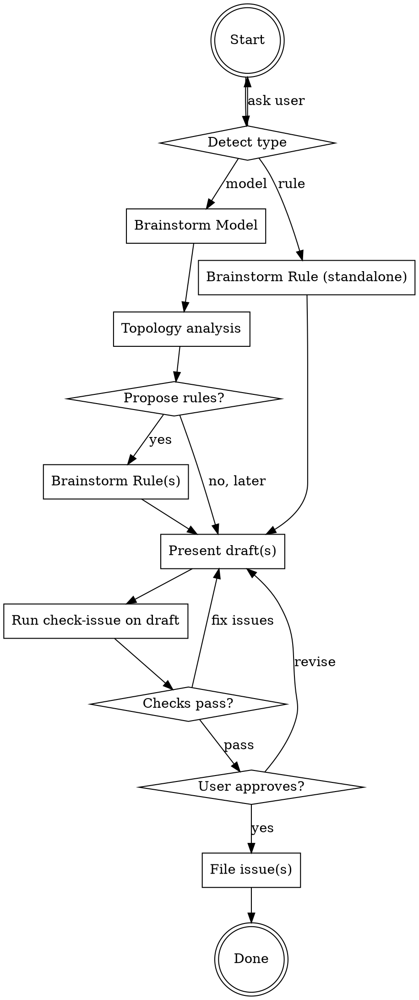

# Propose a New Model or Rule

Interactive brainstorming skill that helps domain experts (who may not know the codebase) design a new problem model or reduction rule, then files well-formed GitHub issues.

**No programming knowledge required.** This skill works entirely in mathematical / domain language.

## Invocation

```
/propose
/propose model
/propose rule
```

<HARD-GATE>
Do NOT write any code, create any files, or invoke implementation skills (add-model, add-rule, issue-to-pr).
The ONLY output of this skill is GitHub issues filed via `gh issue create`.
</HARD-GATE>

## Process



---

## Step 1: Detect Type

If the user didn't specify, use `AskUserQuestion`:

```
AskUserQuestion:
  question: "What would you like to propose?"
  header: "Type"
  options:
    - label: "New problem (model)"
      description: "Define a new computational problem to add to the reduction graph"
    - label: "New reduction rule"
      description: "Add a reduction between two existing problems"
```

---

## Step 2: Explore Context

Before asking questions, check what already exists. Try `pred`; if not available, build it first with `make cli`.

```bash
pred list --json 2>/dev/null || (make cli && pred list --json)
```

Also **search for existing GitHub issues** to avoid duplicates and surface related work:

```bash
# Search open rule issues for related reductions
gh issue list --label rule --state open --limit 500 --json number,title

# Search open model issues for related problems
gh issue list --label model --state open --limit 500 --json number,title
```

Filter the results for keywords matching the user's area of interest (e.g., "knapsack", "traveling", "coloring"). When presenting suggestions in Step 3, **note any existing issues** that overlap — e.g., "Note: #138 SubsetSum→Knapsack already filed."

This tells you what problems and reductions are already in the graph — essential for:
- Avoiding duplicate model proposals
- Avoiding duplicate rule proposals (check existing issues!)
- Identifying which problems a new rule could connect to
- Suggesting natural reduction targets

---

## Step 3: Brainstorm (one question at a time)

Ask questions **one at a time**. Prefer multiple-choice when possible. Use mathematical language, not programming language.

### For Models

Work through these topics in order, using `AskUserQuestion` where multiple-choice is natural. Adapt based on answers:

1. **What problem?** — Ask as free text:
   > "What problem are you thinking of? A name, a description, or even a rough idea is fine."

2. **Why useful?** — Use `AskUserQuestion`:
   ```
   AskUserQuestion:
     question: "What's the motivation for this problem? Where does it appear?"
     header: "Motivation"
     options:
       - label: "Combinatorial optimization"
         description: "Scheduling, routing, packing, allocation problems"
       - label: "Physics / simulation"
         description: "Spin systems, ground states, quantum computing"
       - label: "Cryptography / number theory"
         description: "Factoring, lattice problems, code-based crypto"
       - label: "Something else"
         description: "I'll describe the domain"
   ```

3. **Definition** — Use `AskUserQuestion` to clarify problem type, then free text for formal definition:
   ```
   AskUserQuestion:
     question: "What kind of problem is this?"
     header: "Problem type"
     options:
       - label: "Optimization (maximize)"
         description: "Find a solution that maximizes an objective function"
       - label: "Optimization (minimize)"
         description: "Find a solution that minimizes an objective function"
       - label: "Satisfaction (yes/no)"
         description: "Find any solution that meets all constraints, or decide if one exists"
   ```
   Then ask: "Can you state the problem formally? What's the input, constraints, and objective?"

4. **Variables** — Use `AskUserQuestion`:
   ```
   AskUserQuestion:
     question: "How would you represent a solution? What are the decision variables?"
     header: "Variables"
     options:
       - label: "Binary selection"
         description: "Each variable is 0 or 1 (e.g., include/exclude)"
       - label: "k-valued assignment"
         description: "Each variable takes one of k values (e.g., coloring)"
       - label: "Permutation"
         description: "An ordering of all elements (e.g., tour)"
       - label: "Other domain"
         description: "I'll describe the variable structure"
   ```

5. **Complexity** — Ask as free text:
   > "What's the best known exact algorithm? Is the problem NP-hard, and if so, is there a reference?"
   - Help them find references if unsure (use WebSearch)
   - Ask for a concrete complexity expression in terms of problem parameters (e.g., O(2^n), O(1.1996^n))

6. **Example** — Generate 3 candidate examples yourself (varying in size and structure), then present via `AskUserQuestion`:

   ```
   AskUserQuestion:
     question: "Which example instance should we use?"
     header: "Example"
     options:
       - label: "<small instance summary>"
         description: "<brief description — minimal but valid>"
       - label: "<medium instance summary>"
         description: "<brief description — exercises core structure>"
       - label: "<larger instance summary>"
         description: "<brief description — richer, more illustrative>"
   ```

   After the user picks one, provide a complete instance with its known optimal solution.
   - Must exercise the problem's core structure
   - Must be small enough to verify by hand

7. **Data representation** — Use `AskUserQuestion`:
   ```
   AskUserQuestion:
     question: "What data defines an instance of this problem?"
     header: "Input data"
     options:
       - label: "A graph"
         description: "Vertices and edges, possibly weighted"
       - label: "A matrix"
         description: "Rows and columns of numbers"
       - label: "A set system"
         description: "A universe of elements and a collection of subsets"
       - label: "Something else"
         description: "I'll describe the input structure"
   ```

After model brainstorming is complete, proceed to **Step 3b: Topology Analysis**.

### For Rules (standalone)

Work through these topics in order, using `AskUserQuestion` for each step:

1. **Which problems?** — First run topology analysis (orphans, NP-hardness gaps, `pred list --json`) to identify the most needed rules. Then present suggestions via `AskUserQuestion`:

   ```
   AskUserQuestion:
     question: "Which reduction would you like to propose?"
     header: "Reduction"
     options:
       - label: "<Source> → <Target> (Recommended)"
         description: "<why this is the most valuable — e.g., connects orphan, fills NP-hardness gap>"
       - label: "<Source> → <Target>"
         description: "<why valuable>"
       - label: "<Source> → <Target>"
         description: "<why valuable>"
       - label: "I have a different pair"
         description: "I'll describe the source and target problems"
   ```

   Populate the suggestions based on topology analysis:
   - **Priority 1:** Rules that connect orphan problems (8 orphans: BMF, BicliqueCover, CVP, GraphPartitioning, Knapsack, MaximalIS, MinimumFeedbackVertexSet, PaintShop)
   - **Priority 2:** Rules that fill NP-hardness proof gaps (BinPacking, LongestCommonSubsequence, TravelingSalesman have no inbound path from 3-SAT)
   - **Priority 3:** Rules to large clusters (QUBO, ILP, SAT families)

   After selection, verify both problems exist (or one is being proposed alongside).

2. **Why useful?** — Use `AskUserQuestion`:
   ```
   AskUserQuestion:
     question: "What makes this reduction valuable?"
     header: "Motivation"
     options:
       - label: "Connects an isolated problem"
         description: "Links an orphan problem to the main graph"
       - label: "Enables a new solver"
         description: "Allows solving via the target problem's solvers (e.g., ILP, QUBO)"
       - label: "Proves NP-hardness"
         description: "Establishes hardness via a chain from 3-SAT"
       - label: "Shorter reduction path"
         description: "Provides a more efficient path than what currently exists"
   ```
   Also check if a path already exists: `pred path <source> <target> --json`

3. **Algorithm** — Ask as a free-text question (no multiple choice here):
   > "How does the reduction work? Given a source instance, how do you construct the target instance? Please describe step by step."
   - Must define all symbols before using them
   - Must be detailed enough that someone could implement it
   - If the user is unsure, use WebSearch to find known reductions in the literature

4. **Correctness** — Ask as free text:
   > "Why does this work? Why does an optimal solution to the target correspond to an optimal solution of the source?"

5. **Size overhead** — Ask as free text:
   > "How large is the target instance relative to the source? E.g., if the source has n vertices and m edges, how many variables/constraints does the target have?"

6. **Example** — Generate 3 candidate examples yourself (varying in size and structure), then present via `AskUserQuestion`:

   ```
   AskUserQuestion:
     question: "Which example instance should we use?"
     header: "Example"
     options:
       - label: "<small instance summary>"
         description: "<brief description — e.g., 3 items, capacity 5, optimal: items {1,2}>"
       - label: "<medium instance summary>"
         description: "<brief description — shows a non-obvious optimum>"
       - label: "<larger instance summary>"
         description: "<brief description — richer structure, more trade-offs>"
   ```

   After the user picks one, fully work out the example: show source instance, each construction step, resulting target instance, and the optimal solution.
   - Must be non-trivial but hand-verifiable
   - Must exercise the core structure of the reduction

7. **Reference** — Use `AskUserQuestion`:
   ```
   AskUserQuestion:
     question: "Is there a paper or textbook that describes this reduction?"
     header: "Reference"
     options:
       - label: "Yes, I have a reference"
         description: "I'll provide the citation"
       - label: "No, please help find one"
         description: "Search the literature for a known reduction"
       - label: "This is a novel reduction"
         description: "I designed this myself — no existing reference"
   ```

---

## Step 3b: Topology Analysis (models only)

After the model definition is clear, analyze the reduction graph to suggest which rules would be most valuable. Run:

```bash
# Check orphan problems (to understand graph structure)
cargo run --example detect_isolated_problems 2>/dev/null

# Check NP-hardness proof gaps (to find problems that need connections)
cargo run --example detect_unreachable_from_3sat 2>/dev/null

# List existing problems and reductions
pred list --json

# Check if paths exist between the new problem's likely neighbors
pred path <similar_problem_A> <similar_problem_B> --json
```

Based on the topology analysis, present the user with **suggested reductions** via `AskUserQuestion` (use `multiSelect: true`):

```
AskUserQuestion:
  question: "Which reductions would you like to propose to connect your problem to the graph? (select one or more)"
  header: "Rules"
  multiSelect: true
  options:
    - label: "<Source> → <Target> (Recommended)"
      description: "<why most valuable — e.g., proves NP-hardness, connects to main cluster>"
    - label: "<Source> → <Target>"
      description: "<why valuable>"
    - label: "<Source> → <Target>"
      description: "<why valuable>"
    - label: "I'll file rules separately"
      description: "Skip companion rules for now (model may be flagged as orphan)"
```

**Ranking criteria** (in order of priority):
- Connections that establish NP-hardness (from a problem reachable from 3-SAT)
- Connections to large clusters (QUBO, ILP, SAT families)
- Connections that reduce orphan count or bridge disconnected components
- Connections the user specifically mentioned during brainstorming

---

## Step 3c: Brainstorm Companion Rules (models only)

If the user picks one or more rules from Step 3b (or proposes their own):

For **each** selected rule, run through the rule brainstorming flow (algorithm, correctness, overhead, example, reference) — but keep it lighter since the model context is already established.

If the user declines ("I'll file rule issues separately later"):
- Accept this, but include a placeholder in the model's "Reduction Rule Crossref" section noting which rules are planned
- Warn: "Note: the model issue will reference planned rules. If no rule issue is filed, the model may be flagged as an orphan during review."

---

## Step 4: Present Draft Issue(s)

Once all information is collected, compose the full issue body following the GitHub issue template format.

If proposing a model + rules, present all drafts together:

> "Here are the draft issues. Please review — I can revise any section before filing."
>
> **Issue 1: [Model] ProblemName**
> (full draft)
>
> **Issue 2: [Rule] ProblemName to QUBO**
> (full draft)

**For models**, the draft must include all template sections:
- Motivation
- Definition (Name, Reference, formal definition)
- Variables (Count, Per-variable domain, Meaning)
- Schema (Type name, Variants, Field table — use mathematical types, not programming types)
- Complexity (expression + citation)
- Extra Remark (if applicable)
- Reduction Rule Crossref (linking to companion rule issues or noting planned rules)
- How to solve (brute-force, ILP, or other)
- Example Instance

**For rules**, the draft must include:
- Source, Target, Motivation, Reference
- Reduction Algorithm (numbered steps, all symbols defined)
- Size Overhead (table with target metrics and formulas)
- Validation Method
- Example (fully worked)

---

## Step 5: Run Check-Issue on Draft (BEFORE filing)

**Critical: Run the check-issue logic on the draft BEFORE filing.** This catches problems early and avoids filing issues that will fail review.

Apply all 4 checks from `/check-issue` against the draft content:

### Rule draft checks
1. **Usefulness:** `pred path <source> <target>` — verify no existing path. If path exists, run redundancy analysis.
2. **Non-trivial:** Review the algorithm for genuine structural transformation (not just variable substitution or subtype coercion).
3. **Correctness:** Verify references exist (check `check-issue/references.md`, `docs/paper/references.bib`, then WebSearch). Cross-check claims.
4. **Well-written:** Verify all sections present, symbols consistent, overhead table field names match `pred show <target> --json` → `size_fields`, example is fully worked.

### Model draft checks
1. **Usefulness:** `pred show <name>` must fail (problem doesn't exist). At least one reduction planned.
2. **Non-trivial:** Not isomorphic to existing problem.
3. **Correctness:** Complexity expression verified against literature.
4. **Well-written:** All template sections present, symbols consistent, example exercises core structure.

**If any check fails:** Fix the draft automatically if possible. If user input is needed, ask. Loop back to Step 4 with the corrected draft.

**If all checks pass:** Show the user a summary: "Draft passes all 4 quality checks (Usefulness ✅, Non-trivial ✅, Correctness ✅, Well-written ✅). Ready to file."

Then present for approval via `AskUserQuestion`:

```
AskUserQuestion:
  question: "The draft passes all quality checks. Ready to file?"
  header: "Approval"
  options:
    - label: "File it"
      description: "File the GitHub issue as-is"
    - label: "Revise first"
      description: "I have changes to suggest before filing"
```

---

## Step 6: File the Issue(s)

Once the user approves, file all issues. For model + rule bundles, file the model issue first so rule issues can cross-reference it.

```bash
# File model issue first
gh issue create \
  --title "[Model] ProblemName" \
  --label "model" \
  --body "$(cat <<'EOF'
<model issue body>
EOF
)"
```

Capture the model issue number, then file companion rule issues with cross-references:

```bash
gh issue create \
  --title "[Rule] ProblemName to Target" \
  --label "rule" \
  --body "$(cat <<'EOF'
<rule issue body, referencing #model-issue-number>
EOF
)"
```

After filing all rule issues, update the model issue's "Reduction Rule Crossref" section with the actual issue numbers:

```bash
# Update model issue body to replace placeholder with real issue numbers
gh issue edit <model-issue-number> --body "$(cat <<'EOF'
<updated body with real rule issue numbers>
EOF
)"
```

Print all issue URLs when done.

---

## Key Principles

- **Use `AskUserQuestion` for structured choices** — whenever the user needs to pick from options (type detection, problem selection, motivation, variable type, data structure, reference type, approval), use the `AskUserQuestion` tool with well-labeled options. Use free text only for open-ended questions (algorithm description, formal definitions, examples, complexity expressions).
- **One question at a time** — don't overwhelm; each `AskUserQuestion` call has one focused question
- **Mathematical language only** — never mention Rust types, traits, macros, or code patterns to the user
- **Help find references** — use WebSearch to help locate papers, verify claims
- **Suggest, don't prescribe** — if the user is unsure about complexity or reductions, propose candidates and let them choose
- **Topology-driven suggestions** — run topology analysis first, then populate `AskUserQuestion` options with the most needed reductions ranked by value
- **Self-check before filing** — catch problems before they reach review
- **No implementation** — this skill produces issues, nothing else

## Common Mistakes

- **Don't ask all questions at once.** One `AskUserQuestion` call per message.
- **Don't use plain text for structured choices.** If the user needs to pick from options, use `AskUserQuestion` — not a bulleted list in plain text.
- **Don't use programming jargon.** Say "list of weights" not "Vec<W>". Say "graph" not "SimpleGraph". Say "integer" not "i32".
- **Don't skip the reduction crossref.** An orphan model will be rejected.
- **Don't file without user approval.** Always show the draft first.
- **Don't implement anything.** The output is issues, not code.
- **Don't skip topology analysis for rules.** Always run topology analysis first, then populate `AskUserQuestion` options with the most needed reductions.
