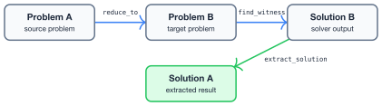
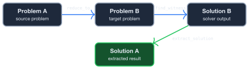

# Getting Started

## What This Library Does

**problem-reductions** transforms hard computational problems into forms that efficient solvers can handle. You define a problem, reduce it to another problem type (like QUBO or ILP), solve the reduced problem, and extract the solution back. The [interactive reduction graph](./introduction.html) shows all available problem types and transformations.

## Installation

Add to your `Cargo.toml`:

```toml
[dependencies]
problemreductions = "0.2"
```

## The Reduction Workflow

The core workflow is: **create** a problem, **reduce** it to a target, **solve** the target, and **extract** the solution back.

<div class="theme-light-only">



</div>
<div class="theme-dark-only">



</div>

### Example 1: Direct reduction — Set Packing to ILP

Reduce Maximum Set Packing to Integer Linear Programming (ILP), solve with the
ILP solver, and extract the solution back.

#### Step 1 — Create the source problem

A small set system with pairwise overlaps gives a direct binary ILP.

```rust,ignore
use problemreductions::prelude::*;
use problemreductions::models::algebraic::ILP;
use problemreductions::solvers::ILPSolver;

let problem = MaximumSetPacking::<i32>::new(vec![
    vec![0, 1],
    vec![1, 2],
    vec![2, 3],
    vec![4, 5],
]);
```

#### Step 2 — Reduce to ILP

`ReduceTo` applies a single-step reduction. The result holds the target
problem and knows how to map solutions back. The ILP formulation introduces
binary variable x_i for each set, constraint x_i + x_j ≤ 1 for each
overlapping pair, and maximizes the weighted sum.

```rust,ignore
let reduction = ReduceTo::<ILP>::reduce_to(&problem);
let ilp = reduction.target_problem();
println!("ILP: {} variables, {} constraints", ilp.num_vars, ilp.constraints.len());
```

```text
ILP: 4 variables, 2 constraints
```

#### Step 3 — Solve the ILP

`ILPSolver` uses the HiGHS solver to find optimal solutions efficiently.
For small instances you can also use `BruteForce`, but `ILPSolver` scales
to much larger problems.

```rust,ignore
let solver = ILPSolver::new();
let ilp_solution = solver.solve(ilp).unwrap();
println!("ILP solution: {:?}", ilp_solution);
```

```text
ILP solution: [1, 0, 1, 0]
```

#### Step 4 — Extract and verify

`extract_solution` maps the ILP solution back to the original problem's
configuration space.

```rust,ignore
let solution = reduction.extract_solution(&ilp_solution);
let metric = problem.evaluate(&solution);
println!("Packing solution: {:?} -> size {:?}", solution, metric);
assert!(metric.is_valid());
```

```text
Packing solution: [1, 0, 1, 1] -> size Valid(3)
```

For convenience, `ILPSolver::solve_reduced` combines reduce + solve + extract
in a single call:

```rust,ignore
let solution = ILPSolver::new().solve_reduced(&problem).unwrap();
assert!(problem.evaluate(&solution).is_valid());
```

### Example 2: Reduction path search — integer factoring to spin glass

Real-world problems often require **chaining** multiple reductions. Here we factor the integer 6 by reducing `Factoring` through the reduction graph to `SpinGlass`, through automatic reduction path search. ([full source](https://github.com/CodingThrust/problem-reductions/blob/main/examples/chained_reduction_factoring_to_spinglass.rs))

Let's walk through each step.

#### Step 1 — Discover the reduction path

`ReductionGraph` holds every registered reduction. `find_cheapest_path`
searches for the shortest chain from a source problem variant to a target
variant.

```rust,ignore
{{#include ../../examples/chained_reduction_factoring_to_spinglass.rs:step1}}
```

```text
  Factoring → CircuitSAT → SpinGlass {graph: "SimpleGraph", weight: "i32"}
```

#### Step 2 — Create the Factoring problem

`Factoring::new(m, n, target)` creates a factoring instance: find two factors
`p` (m-bit) and `q` (n-bit) such that `p × q = target`. Here we factor **6**
with two 2-bit factors, expecting **2 × 3** or **3 × 2**.

```rust,ignore
{{#include ../../examples/chained_reduction_factoring_to_spinglass.rs:step2}}
```

#### Step 3 — Solve with ILPSolver

`solve_reduced` reduces the problem to ILP internally and solves it in one
call. It returns a configuration vector for the original problem — no manual
extraction needed. For small instances you can also use `BruteForce`, but
`ILPSolver` scales to much larger problems.

```rust,ignore
{{#include ../../examples/chained_reduction_factoring_to_spinglass.rs:step3}}
```

#### Step 4 — Read and verify the factors

`read_factors` decodes the binary configuration back into the two integer
factors.

```rust,ignore
{{#include ../../examples/chained_reduction_factoring_to_spinglass.rs:step4}}
```

```text
6 = 3 × 2
```

#### Step 5 — Inspect the overhead

Each reduction edge carries a polynomial overhead mapping source problem
sizes to target sizes. `path_overheads` returns the per-edge
polynomials, and `compose_path_overhead` composes them symbolically into a
single end-to-end formula.

```rust,ignore
{{#include ../../examples/chained_reduction_factoring_to_spinglass.rs:overhead}}
```

```text
Factoring → CircuitSAT:
  num_variables = num_bits_first * num_bits_second
  num_assignments = num_bits_first * num_bits_second
CircuitSAT → SpinGlass {graph: "SimpleGraph", weight: "i32"}:
  num_spins = num_assignments
  num_interactions = num_assignments
SpinGlass {graph: "SimpleGraph", weight: "i32"} → SpinGlass {graph: "SimpleGraph", weight: "f64"}:
  num_spins = num_spins
  num_interactions = num_interactions
Composed (source → target):
  num_spins = num_bits_first * num_bits_second
  num_interactions = num_bits_first * num_bits_second
```

## Solvers

Two solvers are available:

| Solver | Use Case | Notes |
|--------|----------|-------|
| [`BruteForce`](api/problemreductions/solvers/struct.BruteForce.html) | Small instances (<20 variables) | Enumerates all configurations |
| [`ILPSolver`](api/problemreductions/solvers/ilp/struct.ILPSolver.html) | Larger instances | Enabled by default (`ilp` feature) |

ILP support is enabled by default. To disable it:

```toml
[dependencies]
problemreductions = { version = "0.2", default-features = false }
```

## JSON Resources

The library exports machine-readable metadata useful for tooling and research:

- [reduction_graph.json](reductions/reduction_graph.json) lists all problem variants and reduction edges
- [problem_schemas.json](reductions/problem_schemas.json) lists field definitions for each problem type


## Next Steps

- Try the [CLI tool](./cli.md) to explore problems and reduction paths from your terminal
- Explore the [interactive reduction graph](./introduction.html) to discover available reductions
- Read the [Design](./design.md) guide for implementation details
- Browse the [API Reference](./api.html) for full documentation
